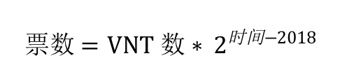
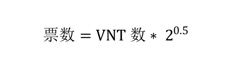

# VNT节点投票规则

## 一、如何投票

1） 投票不会消耗VNT，但是需要抵押VNT获得票数。

2） 最多可以给30个不同节点投票。

3） 投票24h后可以重新投票。

4） 投票不会有直接的收益，但投票是为了VNT社区共同的利益，请重视您手中的选票，共同推动VNT生态的发展。

 

## 二、抵押

1) 投票前投票人需要抵押VNT，抵押的VNT数量不做限制，但只能是正整数，同一时间下，票数与抵押的VNT成正比。

2) 抵押的VNT在抵押24小时后才能申请解押，解押后即刻到账。

3) 抵押VNT获得票数的计算:  
&nbsp;&nbsp;&nbsp;VNT票数采用半衰期方式计算，它可以降低投票后不再具有相应VNT所带来的影响。比如，A最初使用10个VNT进行投票，投出了10票，经过1年之后，这部分票值已经变为5票，再过1年变为2.5票。虽然A已经不再拥有10个VNT，但随着时间的推进，A投的票，也在消失。

&nbsp;&nbsp;&nbsp;半衰期一般的计算方式是，经过一段时间，对数值做衰减。对于庞大的投票次数，每次都要对已经投的票做半衰期计算，计算量是庞大的，会导致执行合约非常耗时。

&nbsp;&nbsp;&nbsp;VNT采取相对衰减的方式。假如现在10个VNT，可以转换为10票，一年后10个VNT可以转换为**`10*2`**票。再过一年后，10个VNT可以转换为**`10*2*2`**票。

&nbsp;&nbsp;&nbsp;采用基准年份，使用年为周期。使用相对衰减，就需要使用基准年份，使用相同的基准，计算衰减，可以采用网络上线的年份，比如2018:

  

&nbsp;&nbsp;&nbsp;支持非周期的倍数衰减。比如，现在是2018年的6月份，票数应该为：

  

&nbsp;&nbsp;&nbsp;定义**eraTimeStamp**是半衰期的起始年份，设置为2019年1月1日0时0分0秒，即1546272000，单位秒。我们采用52周作为半衰期的周期，即**`52*7*24*3600`**秒，当前时间距起始年份经过的周数除以52则得到半衰期的系数α，公式如下：

  

 

## 三、投票
&nbsp;&nbsp;1) 投票人在24小时内，只能进行1次投票或设置代理。投票人可以重复投票，以最后一次投票为准。

&nbsp;&nbsp;2) 投票人每次投票最多可以选择30个节点，30个节点将获得相同的票数。

&nbsp;&nbsp;3) 如果投票人想取消当前投票，那么取消勾选所有节点，投票0个节点即可。

 

## 四、代理投票
&nbsp;&nbsp;1) 投票人可以指定代理人，让代理人代表自己投票。不可指定普通投票人作为自己的代理人。

&nbsp;&nbsp;2) 投票人可以把一定数量的VNT抵押出去，然后设置代理人，这些VNT对应的票数会累积到代理人所代理的票数上，会投到代理投的节点。

&nbsp;&nbsp;3) 代理人只是替投票人选择节点，但不会修改投票人的票数。代理人修改投票时，所有它和它代理的票数，会被投到新的节点上，代理人会重新计算自己stake对应的票数，但不会计算它代理的票数。

&nbsp;&nbsp;4) 投票人可以开启代理功能成为代理人，代理人不可以指定代理人进行多级代理，代理人关闭代理功能可变回投票人。